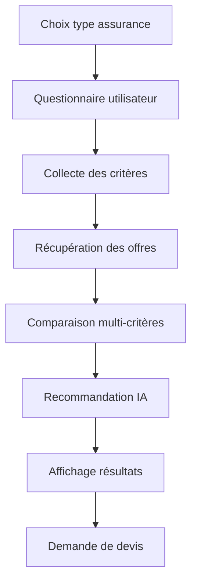
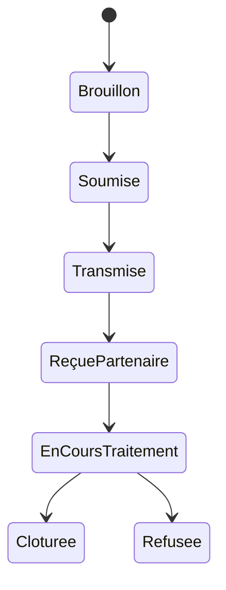

# Spécification Fonctionnelle — Version préliminaire

## Vision et objectifs du système

La plateforme a pour objectif de permettre à des particuliers marocains d’identifier rapidement une assurance adaptée à leurs besoins grâce à un moteur de comparaison et de recommandation assisté par IA.

Le système doit :

- Réduire le temps nécessaire à la recherche d’une assurance.
- Fournir des recommandations compréhensibles et transparentes.
- Comparer des offres selon plusieurs critères métier.
- Générer des demandes de devis qualifiées vers les partenaires.
- Maintenir un positionnement d’outil d’aide à la décision sans se substituer au conseil réglementé.

## Périmètre fonctionnel

### Inclus

- Assurance auto.
- Assurance santé.
- Assurance habitation.
- Questionnaire utilisateur contextualisé.
- Comparaison multi-critères.
- Recommandation personnalisée.
- Explication des recommandations.
- Gestion des offres incomplètes.
- Transmission de demandes de devis.
- Orientation vers conseiller si aucune offre exacte.
- Affichage d’offres partenaires et non partenaires.

### Exclus

- Souscription en ligne.
- Signature électronique.
- Gestion de contrats.
- Gestion des sinistres.
- Utilisateurs professionnels.
- Données médicales détaillées.
- Paiement en ligne.
- Expansion internationale V1.

## Personas et rôles utilisateurs

| Persona | Description | Permissions |
|---|---|---|
| Visiteur | Particulier consultant la plateforme | Comparer des offres, consulter recommandations |
| Demandeur de devis | Utilisateur transmettant ses coordonnées | Envoyer une demande de devis |
| Administrateur plateforme | Gestion métier et supervision | Gérer offres, partenaires, contenu, indicateurs |
| Partenaire assureur/courtier | Réception des leads | Consulter demandes transmises |
| Conseiller partenaire | Recontact utilisateur | Traiter les leads assignés |

## Cas d’utilisation détaillés

### CU-001 — Renseigner un profil et des besoins d’assurance

#### Objectif
Collecter les informations nécessaires à une comparaison pertinente.

#### Acteurs
Utilisateur final.

#### Préconditions
- L’utilisateur a sélectionné un type d’assurance.

#### Parcours nominal
1. L’utilisateur choisit le type d’assurance.
2. Le système affiche un formulaire adapté.
3. L’utilisateur renseigne ses informations.
4. Le système valide les données.
5. Le système enregistre la simulation.
6. Le système lance la recherche d’offres.

#### Parcours alternatifs
- Formulaire partiellement complété.
- Utilisateur modifie son budget ou ses critères.

#### Cas d’erreur
- Champs invalides.
- Informations incompatibles.
- Session expirée.

### CU-002 — Comparer des offres d’assurance

#### Objectif
Afficher une comparaison structurée des offres.

#### Parcours nominal
1. Le moteur récupère les offres.
2. Le système normalise les données.
3. Les offres sont classées.
4. Le système affiche les critères comparés.
5. L’utilisateur peut filtrer ou trier.

#### Cas d’erreur
- Aucune offre disponible.
- Données partenaires indisponibles.
- Offre incomplète.

### CU-003 — Obtenir une recommandation personnalisée expliquée

#### Objectif
Présenter les offres les plus adaptées avec justification.

#### Parcours nominal
1. Le moteur calcule un score par offre.
2. Le système pondère les critères.
3. Le système sélectionne les meilleures offres.
4. Une explication détaillée est générée.
5. Les résultats sont affichés.

#### Cas d’erreur
- Données insuffisantes.
- Score impossible à calculer.

### CU-004 — Demander un devis auprès d’un partenaire

#### Parcours nominal
1. L’utilisateur sélectionne une offre.
2. Le système affiche le formulaire de contact.
3. L’utilisateur valide ses coordonnées.
4. Le système transmet la demande.
5. Le partenaire reçoit le lead.
6. Le système confirme l’envoi.

#### Cas d’erreur
- Transmission échouée.
- Partenaire indisponible.
- Consentement RGPD absent.

## User Stories

- En tant qu’utilisateur, je veux comparer plusieurs assurances afin d’identifier rapidement la plus adaptée.
- En tant qu’utilisateur, je veux comprendre pourquoi une offre est recommandée afin de prendre une décision éclairée.
- En tant qu’utilisateur, je veux demander un devis afin d’être recontacté par un partenaire.
- En tant qu’administrateur, je veux gérer les offres partenaires afin de maintenir des données fiables.
- En tant que partenaire, je veux recevoir des demandes qualifiées afin de convertir des prospects.

## Règles de gestion

| ID | Règle |
|---|---|
| RG-001 | Toute comparaison doit inclure le prix lorsque disponible. |
| RG-002 | Les offres incomplètes doivent afficher un avertissement visible. |
| RG-003 | Les données médicales détaillées sont interdites dans la plateforme. |
| RG-004 | Les offres partenaires sont prioritaires dans l’affichage. |
| RG-005 | Une explication de recommandation doit être affichée pour toute offre recommandée. |
| RG-006 | Si aucune offre exacte n’existe, le système doit proposer les offres les plus proches. |
| RG-007 | Le consentement utilisateur est obligatoire avant transmission d’un devis. |

## Parcours utilisateurs et workflows



## États et transitions des entités métier

### État d’une demande de devis



## Critères d’acceptation

### CU-002 — Comparaison

```text
Given un utilisateur ayant complété le questionnaire
When le moteur de comparaison retourne des offres
Then le système affiche les garanties, exclusions, franchises et prix comparés
```

### CU-004 — Demande de devis

```text
Given un utilisateur ayant choisi une offre
When il valide sa demande de devis
Then la demande est transmise au partenaire concerné
```

## Gestion des erreurs, cas limites et comportements exceptionnels

- Absence d’offres exactes : afficher des offres proches.
- Données partenaires indisponibles : afficher un message de transparence.
- Offre partiellement renseignée : afficher un badge d’avertissement.
- Échec d’intégration API : journaliser l’erreur et notifier l’administrateur.
- Consentement absent : bloquer l’envoi du devis.
- Incohérence de données : empêcher le calcul de recommandation.