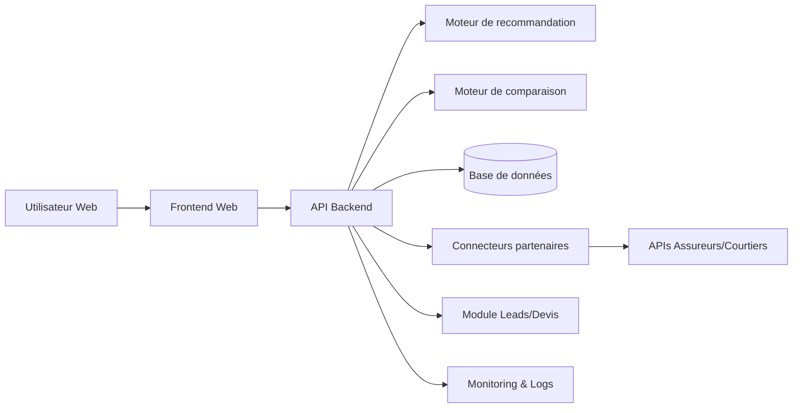
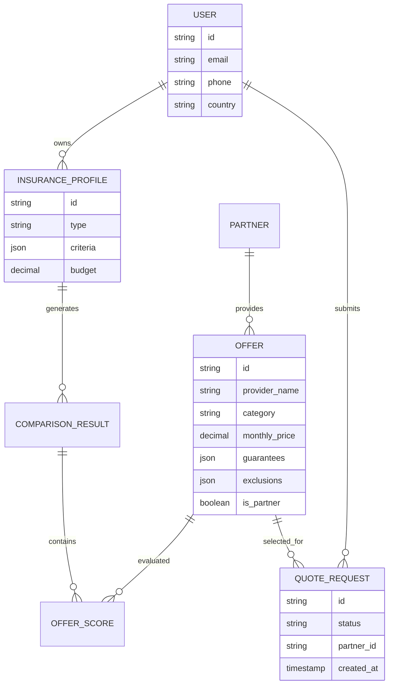
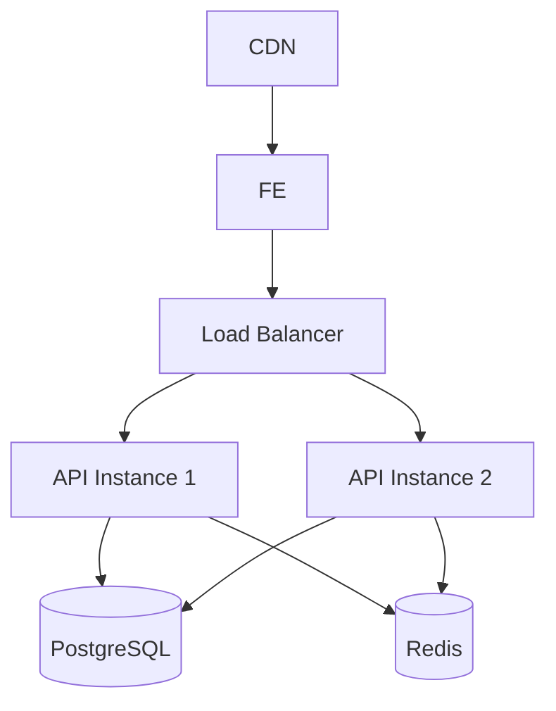

# Spécification Technique — Version préliminaire

## Architecture globale



## Choix technologiques recommandés et justification

| Domaine | Technologie recommandée | Justification |
|---|---|---|
| Frontend | Next.js / React | SEO, performance, expérience utilisateur |
| Backend | Node.js NestJS | Architecture modulaire et APIs robustes |
| Base de données | PostgreSQL | Relationnel robuste et extensible |
| Cache | Redis | Accélération des comparaisons |
| IA/Recommandation | Python FastAPI | Souplesse analytique et scoring |
| Hébergement | AWS ou OVHcloud | Disponibilité Maroc/EU et scalabilité |
| Authentification | JWT + OAuth2 | Standard moderne |

## Découpage en modules / services

| Module | Responsabilités |
|---|---|
| Frontend utilisateur | Parcours utilisateur et affichage |
| API Gateway | Routage et sécurité |
| Service Profil | Gestion questionnaires |
| Service Comparaison | Normalisation et comparaison |
| Service Recommandation | Scoring et explications |
| Service Offres | Gestion catalogue |
| Service Leads | Gestion demandes de devis |
| Service Partenaires | Intégrations assureurs/courtiers |
| Backoffice Admin | Administration métier |
| Monitoring | Logs et alertes |

## Modèle de données



### Entités principales

| Entité | Champs clés | Contraintes |
|---|---|---|
| User | email, téléphone | email unique |
| InsuranceProfile | type, critères, budget | type obligatoire |
| Offer | prix, garanties, exclusions | source obligatoire |
| QuoteRequest | statut, partenaire | consentement obligatoire |
| Partner | nom, type, API endpoint | statut actif requis |

## APIs

### POST /api/v1/comparisons

#### Requête

```json
{
  "insuranceType": "auto",
  "budget": 500,
  "criteria": {
    "vehicleAge": 4,
    "claimsHistory": false
  }
}
```

#### Réponse 200

```json
{
  "comparisonId": "cmp_001",
  "offers": []
}
```

### POST /api/v1/quote-requests

#### Requête

```json
{
  "offerId": "off_001",
  "user": {
    "name": "John Doe",
    "email": "john@example.com"
  },
  "consent": true
}
```

#### Réponses

| Code | Description |
|---|---|
| 201 | Demande créée |
| 400 | Données invalides |
| 403 | Consentement absent |
| 502 | Partenaire indisponible |

## Intégrations avec les systèmes externes

| Intégration | Type | Usage |
|---|---|---|
| APIs assureurs | REST | Récupération offres |
| APIs courtiers | REST | Transmission devis |
| Email provider | SMTP/API | Notifications |
| Analytics | SDK | Suivi KPIs |

## Authentification et gestion des autorisations

| Rôle | Permissions |
|---|---|
| Visiteur | Comparaison |
| Utilisateur identifié | Demande devis |
| Admin | Gestion plateforme |
| Partenaire | Consultation leads |

## Sécurité

- Chiffrement TLS 1.2+.
- Chiffrement des données sensibles au repos.
- Validation stricte des entrées.
- Protection OWASP Top 10.
- Limitation de taux API.
- Journalisation des accès.
- Consentement explicite avant partage des données.
- Isolation des données partenaires.

## Déploiement et infrastructure



- Déploiement conteneurisé Docker.
- Orchestration Kubernetes recommandée.
- Environnements distincts : dev, staging, production.
- Sauvegardes quotidiennes.

## Exigences de performance, scalabilité et monitoring

- Architecture scalable horizontalement.
- Mise en cache des offres fréquemment consultées.
- Monitoring applicatif centralisé.
- Alertes sur indisponibilité partenaires.
- Traçabilité des calculs de recommandation.
- Journalisation des erreurs critiques.